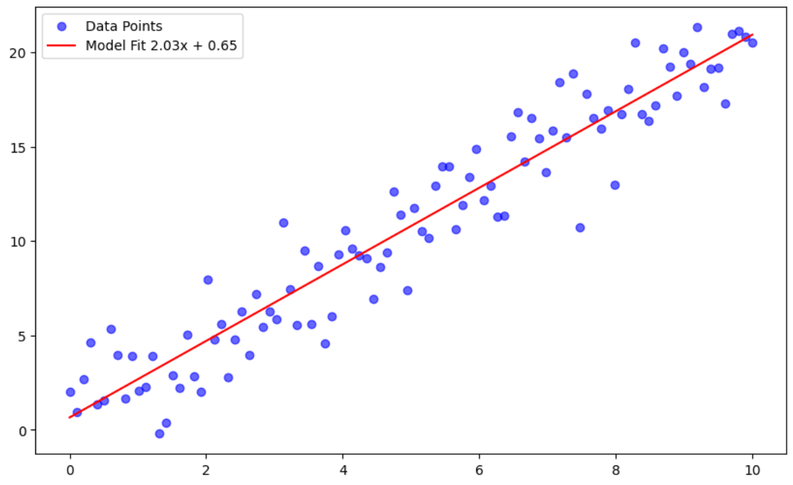
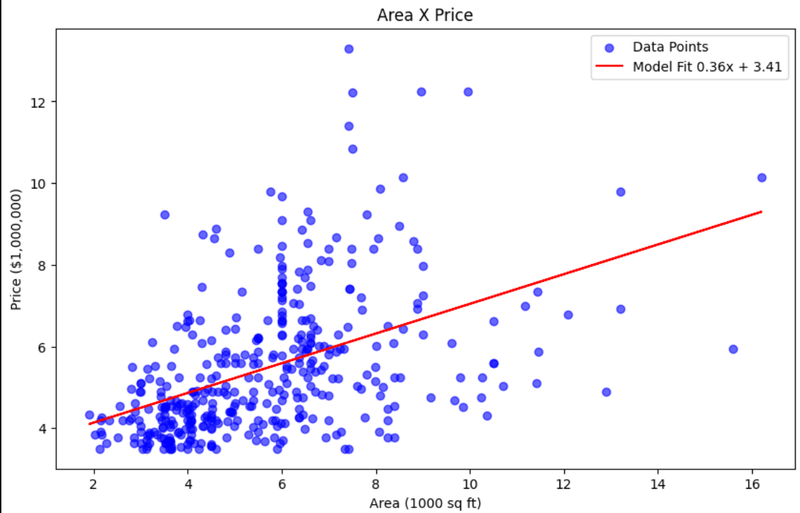

# Implementation of Linear Regression and Gradient Descent Algorithm

## What the program does?
This project includes the implementation of **Linear Regression** and the **Gradient Descent algorithm from scratch** using Python, NumPy, and Matplotlib.

It contains two subdirectories:
- `simple_gradient_descent_implementation`
- `house_prediction`

---

## Simple Gradient Descent Implementation

In this notebook, I implemented the logic behind gradient descent and linear regression.

For a predefined function:

y = 2x + 1 + noise

### Steps:
- Generating 50 sample data values for X between 0 and 10  
- Calculating corresponding Y values  
- Initializing parameters (m, c)  
- Computing gradients manually  
- Updating parameters iteratively  

### Cost Function (MSE)

MSE = (1/n) * Σ (yᵢ - ŷᵢ)²

### Gradients

∂MSE/∂m = (2/n) * Σ (ŷᵢ - yᵢ) * xᵢ  
∂MSE/∂c = (2/n) * Σ (ŷᵢ - yᵢ)

### Update Rule

θ = θ - η ∇L(θ)

Where:
- θ = parameters (m, c)  
- η = learning rate  
- L(θ) = loss function  

---

## What this demonstrates

- How a model learns parameters iteratively  
- How loss decreases over time  
- Connection between math and implementation  
- Gradient descent convergence on clean data  

---

## Model Fit Visualization

### Simple Model

### Observation:
- Model closely approximates y = 2x + 1  
- Learned parameters are very accurate  
- Shows successful convergence  

---

## Housing Price Prediction (Univariate)

In the `house_prediction` notebook, I applied the same gradient descent approach to a real-world dataset.

### What was done:
- Selected feature: **Area**  
- Target: **Price**  
- Implemented univariate linear regression  
- Used same MSE and gradient formulas  

---

## Model Fit Visualization

### Observations:
- Model does not fit data well  
- Indicates price depends on multiple factors  
- Shows limitation of univariate regression  

---

## Key Learnings

- Clean data is easier to optimize than real-world data  
- Feature selection is critical  
- Gradient descent depends on:
  - Learning rate (η)
  - Number of iterations  
- Real datasets require:
  - Multiple features  
  - Better preprocessing  

---

## Future Work

- Improve housing model accuracy  
- Implement **Multivariable Linear Regression**  
---

